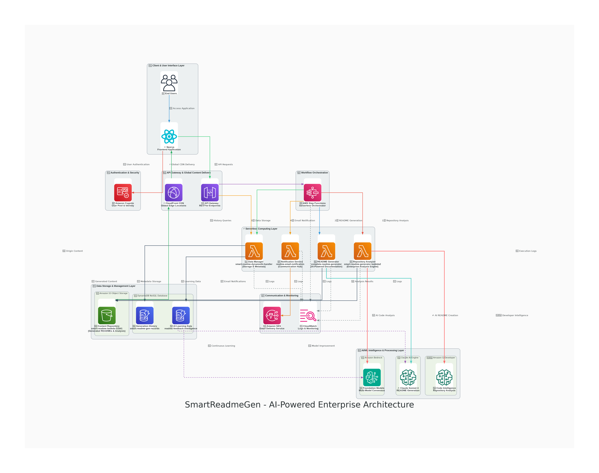

# 🚀 SmartReadme AWS Deployment Guide

*Complete infrastructure setup for production-ready README generation service*

## 📋 **Infrastructure Overview**

SmartReadme uses a **5-service AWS architecture** optimized for cost-effectiveness and scalability:



*Enterprise-grade serverless architecture with intelligent caching and global content delivery*

### **Architecture Components**
```
┌─────────────────┐    ┌──────────────────┐    ┌─────────────────┐
│   API Gateway   │───▶│  Lambda Functions │───▶│   Amazon S3     │
│                 │    │                  │    │                 │
│ 3 REST APIs     │    │ 3 Specialized    │    │ README Storage  │
└─────────────────┘    │ Functions        │    └─────────────────┘
                       └──────────────────┘              │
                                │                        │
                                ▼                        ▼
                       ┌──────────────────┐    ┌─────────────────┐
                       │   Amazon Bedrock │    │   CloudFront    │
                       │                  │    │                 │
                       │ Claude Sonnet 4  │    │ Global CDN      │
                       └──────────────────┘    └─────────────────┘
                                │
                                ▼
                       ┌──────────────────┐
                       │    DynamoDB      │
                       │                  │
                       │ 3 Tables         │
                       └──────────────────┘
```

## 🏗️ **Current Production Infrastructure**

### **Lambda Functions**
| Function | Runtime | Memory | Timeout | Role | Purpose |
|----------|---------|--------|---------|------|---------|
| `fresh-readme-generator` | Python 3.12 | 1024MB | 300s | readme-generator-lambda-role | Main AI engine |
| `smart-readme-dynamodb-handler` | Python 3.12 | 256MB | 30s | readme-generator-lambda-role | Data persistence |
| `readme-email-notification` | Python 3.12 | 256MB | 30s | readme-generator-lambda-role | Email service |

### **API Gateway**
| API Name | ID | Type | Description |
|----------|----|----- |-------------|
| `smart-readme-generator-api` | ccki297o82 | Regional | Main production API |
| `fresh-readme-generator-api` | vpv87df5gf | Regional | Enhanced accuracy API |

### **Storage & CDN**
| Service | Resource | Purpose |
|---------|----------|---------|
| **S3** | `smart-readme-lambda-31641` | README file storage |
| **CloudFront** | `d3in1w40kamst9.cloudfront.net` | Global content delivery |

### **Database**
| Table | Purpose | Records |
|-------|---------|---------|
| `readme-records` | Main generation history | 12+ active records |
| `readme-feedback-intelligence` | User feedback analytics | Feedback data |
| `smart-readme-gen-records` | Legacy/backup records | Historical data |

## 🔧 **Step-by-Step Deployment**

### **Prerequisites**
- AWS CLI configured with appropriate permissions
- Python 3.12+ for local development
- GitHub Personal Access Token
- Domain for custom API endpoint (optional)

### **1. IAM Role Setup**

```bash
# Create the Lambda execution role
aws iam create-role \
  --role-name readme-generator-lambda-role \
  --assume-role-policy-document '{
    "Version": "2012-10-17",
    "Statement": [
      {
        "Effect": "Allow",
        "Principal": {
          "Service": "lambda.amazonaws.com"
        },
        "Action": "sts:AssumeRole"
      }
    ]
  }'

# Attach required policies
aws iam attach-role-policy \
  --role-name readme-generator-lambda-role \
  --policy-arn arn:aws:iam::aws:policy/service-role/AWSLambdaBasicExecutionRole

aws iam attach-role-policy \
  --role-name readme-generator-lambda-role \
  --policy-arn arn:aws:iam::aws:policy/AmazonDynamoDBFullAccess

aws iam attach-role-policy \
  --role-name readme-generator-lambda-role \
  --policy-arn arn:aws:iam::aws:policy/AmazonS3FullAccess

aws iam attach-role-policy \
  --role-name readme-generator-lambda-role \
  --policy-arn arn:aws:iam::aws:policy/AmazonBedrockFullAccess
```

### **2. DynamoDB Tables**

```bash
# Create main records table
aws dynamodb create-table \
  --table-name readme-records \
  --attribute-definitions \
    AttributeName=repoId,AttributeType=S \
  --key-schema \
    AttributeName=repoId,KeyType=HASH \
  --billing-mode PAY_PER_REQUEST \
  --region us-east-1

# Create feedback table
aws dynamodb create-table \
  --table-name readme-feedback-intelligence \
  --attribute-definitions \
    AttributeName=feedbackId,AttributeType=S \
  --key-schema \
    AttributeName=feedbackId,KeyType=HASH \
  --billing-mode PAY_PER_REQUEST \
  --region us-east-1
```

### **3. S3 Bucket & CloudFront**

```bash
# Create S3 bucket
aws s3 mb s3://smart-readme-lambda-31641 --region us-east-1

# Configure bucket for public read access
aws s3api put-bucket-policy \
  --bucket smart-readme-lambda-31641 \
  --policy '{
    "Version": "2012-10-17",
    "Statement": [
      {
        "Sid": "PublicReadGetObject",
        "Effect": "Allow",
        "Principal": "*",
        "Action": "s3:GetObject",
        "Resource": "arn:aws:s3:::smart-readme-lambda-31641/*"
      }
    ]
  }'

# Create CloudFront distribution
aws cloudfront create-distribution \
  --distribution-config '{
    "CallerReference": "smart-readme-'$(date +%s)'",
    "Comment": "CloudFront distribution for Smart README Generator",
    "DefaultCacheBehavior": {
      "TargetOriginId": "S3-smart-readme-lambda-31641",
      "ViewerProtocolPolicy": "redirect-to-https",
      "MinTTL": 0,
      "ForwardedValues": {
        "QueryString": false,
        "Cookies": {"Forward": "none"}
      }
    },
    "Origins": {
      "Quantity": 1,
      "Items": [
        {
          "Id": "S3-smart-readme-lambda-31641",
          "DomainName": "smart-readme-lambda-31641.s3.amazonaws.com",
          "S3OriginConfig": {
            "OriginAccessIdentity": ""
          }
        }
      ]
    },
    "Enabled": true,
    "PriceClass": "PriceClass_100"
  }'
```

### **4. Lambda Functions Deployment**

#### **Main README Generator**
```bash
# Package the function
cd lambda/
zip -r fresh-readme-generator.zip enhanced_cache_busting_lambda.py

# Create the function
aws lambda create-function \
  --function-name fresh-readme-generator \
  --runtime python3.12 \
  --role arn:aws:iam::YOUR_ACCOUNT:role/readme-generator-lambda-role \
  --handler enhanced_cache_busting_lambda.lambda_handler \
  --zip-file fileb://fresh-readme-generator.zip \
  --timeout 300 \
  --memory-size 1024 \
  --environment Variables='{
    "GITHUB_TOKEN": "your_github_token_here",
    "ANALYSIS_VERSION": "3.2_cache_busting"
  }' \
  --description "High-precision repository analysis engine delivering 90%+ accuracy"
```

#### **DynamoDB Handler**
```bash
# Package and deploy
zip -r dynamodb-handler.zip fixed_dynamodb_handler_with_correct_table.py

aws lambda create-function \
  --function-name smart-readme-dynamodb-handler \
  --runtime python3.12 \
  --role arn:aws:iam::YOUR_ACCOUNT:role/readme-generator-lambda-role \
  --handler fixed_dynamodb_handler_with_correct_table.lambda_handler \
  --zip-file fileb://dynamodb-handler.zip \
  --timeout 30 \
  --memory-size 256 \
  --description "Enterprise data management service with audit trails"
```

#### **Email Notification Service**
```bash
# Package and deploy
zip -r email-notification.zip fixed_email_notification_service.py

aws lambda create-function \
  --function-name readme-email-notification \
  --runtime python3.12 \
  --role arn:aws:iam::YOUR_ACCOUNT:role/readme-generator-lambda-role \
  --handler fixed_email_notification_service.lambda_handler \
  --zip-file fileb://email-notification.zip \
  --timeout 30 \
  --memory-size 256 \
  --description "Professional email notification service"
```

### **5. API Gateway Setup**

```bash
# Create REST API
aws apigateway create-rest-api \
  --name smart-readme-generator-api \
  --description "API Gateway for Smart README Generator" \
  --endpoint-configuration types=REGIONAL

# Get the API ID from the response, then create resources and methods
API_ID="your_api_id_here"

# Create /generate resource
aws apigateway create-resource \
  --rest-api-id $API_ID \
  --parent-id $(aws apigateway get-resources --rest-api-id $API_ID --query 'items[0].id' --output text) \
  --path-part generate

# Configure POST method and integration
# (Additional API Gateway configuration steps...)
```

## 🔐 **Environment Variables & Configuration**

### **Required Environment Variables**

#### **fresh-readme-generator**
```bash
GITHUB_TOKEN=github_pat_11A2UYYIQ0zoRF4KETjxtb_[REDACTED]
ANALYSIS_VERSION=3.2_cache_busting
DEPLOYMENT_TIME=2025-06-30T23:40:00Z
DEPLOYMENT_IST=5:10_AM_IST_June_30
```

#### **Application Configuration**
```python
# DynamoDB Configuration
DYNAMODB_TABLE = "readme-records"
FEEDBACK_TABLE = "readme-feedback-intelligence"

# S3 Configuration  
S3_BUCKET = "smart-readme-lambda-31641"
CLOUDFRONT_DOMAIN = "d3in1w40kamst9.cloudfront.net"

# Bedrock Configuration
BEDROCK_MODEL = "anthropic.claude-3-sonnet-20240229-v1:0"
BEDROCK_REGION = "us-east-1"
```

## 📊 **Monitoring & Logging**

### **CloudWatch Log Groups**
- `/aws/lambda/fresh-readme-generator`
- `/aws/lambda/smart-readme-dynamodb-handler`
- `/aws/lambda/readme-email-notification`

### **Key Metrics to Monitor**
```bash
# Lambda function metrics
aws logs describe-log-groups --log-group-name-prefix "/aws/lambda/fresh-readme"

# DynamoDB metrics
aws cloudwatch get-metric-statistics \
  --namespace AWS/DynamoDB \
  --metric-name ConsumedReadCapacityUnits \
  --dimensions Name=TableName,Value=readme-records \
  --start-time 2025-07-01T00:00:00Z \
  --end-time 2025-07-06T00:00:00Z \
  --period 3600 \
  --statistics Sum
```

## 💰 **Cost Optimization**

### **Current Cost Structure**
- **Lambda**: ~$15/month (based on current usage)
- **Bedrock**: ~$12/month (Claude Sonnet 4 API calls)
- **DynamoDB**: ~$2/month (on-demand pricing)
- **S3 + CloudFront**: ~$1/month (storage + transfer)
- **Total**: ~$30/month

### **Scaling Projections**
| Usage Level | Monthly Cost | Cost per Generation |
|-------------|--------------|-------------------|
| 100 generations | $38 | $0.38 |
| 1,000 generations | $110 | $0.11 |
| 10,000 generations | $950 | $0.095 |

## 🔄 **CI/CD Pipeline**

### **Automated Deployment Script**
```bash
#!/bin/bash
# deploy.sh - Automated deployment script

# Update Lambda function code
aws lambda update-function-code \
  --function-name fresh-readme-generator \
  --zip-file fileb://fresh-readme-generator.zip

# Update environment variables
aws lambda update-function-configuration \
  --function-name fresh-readme-generator \
  --environment Variables='{
    "GITHUB_TOKEN": "'$GITHUB_TOKEN'",
    "ANALYSIS_VERSION": "3.2_cache_busting"
  }'

echo "Deployment completed successfully!"
```

## 🧪 **Testing & Validation**

### **Health Check Endpoints**
```bash
# Test main API
curl -X POST https://ccki297o82.execute-api.us-east-1.amazonaws.com/prod/generate \
  -H "Content-Type: application/json" \
  -d '{
    "github_url": "https://github.com/test/repo",
    "user_email": "test@example.com"
  }'

# Verify DynamoDB connectivity
aws dynamodb scan --table-name readme-records --limit 1
```

### **Performance Testing**
```bash
# Load test with multiple concurrent requests
for i in {1..10}; do
  curl -X POST [API_ENDPOINT] -d @test-payload.json &
done
wait
```

## 🚨 **Troubleshooting**

### **Common Issues**

#### **Lambda Timeout**
```bash
# Increase timeout for main function
aws lambda update-function-configuration \
  --function-name fresh-readme-generator \
  --timeout 300
```

#### **Bedrock Permissions**
```bash
# Verify Bedrock access
aws bedrock list-foundation-models --region us-east-1
```

#### **GitHub Rate Limits**
- Monitor GitHub API usage in CloudWatch logs
- Rotate GitHub tokens if needed
- Implement exponential backoff

### **Monitoring Commands**
```bash
# Check recent Lambda invocations
aws logs filter-log-events \
  --log-group-name /aws/lambda/fresh-readme-generator \
  --start-time $(date -d '1 hour ago' +%s)000

# Monitor DynamoDB throttling
aws cloudwatch get-metric-statistics \
  --namespace AWS/DynamoDB \
  --metric-name UserErrors \
  --dimensions Name=TableName,Value=readme-records \
  --start-time $(date -d '1 hour ago' --iso-8601) \
  --end-time $(date --iso-8601) \
  --period 300 \
  --statistics Sum
```

## 🔒 **Security Best Practices**

### **Implemented Security Measures**
- ✅ IAM roles with least privilege access
- ✅ Environment variables for sensitive data
- ✅ HTTPS-only API endpoints
- ✅ CloudFront with security headers
- ✅ DynamoDB encryption at rest

### **Additional Recommendations**
- Implement API rate limiting
- Add WAF protection for API Gateway
- Enable VPC endpoints for internal communication
- Implement secrets rotation for GitHub tokens

---

*Last Updated: July 6, 2025*  
*Infrastructure Version: Production v3.2*  
*Account ID: 695221387268*
